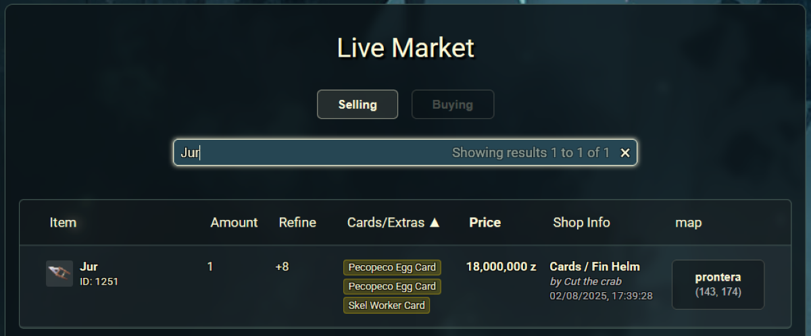
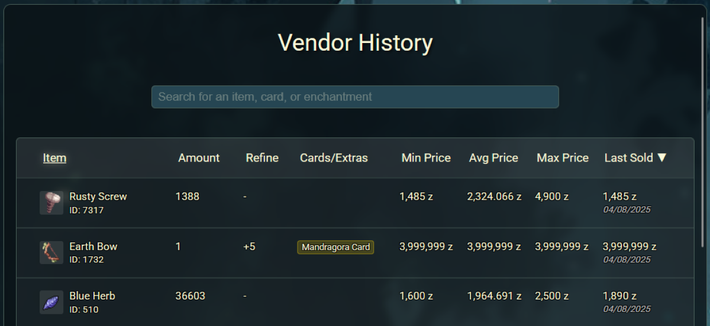
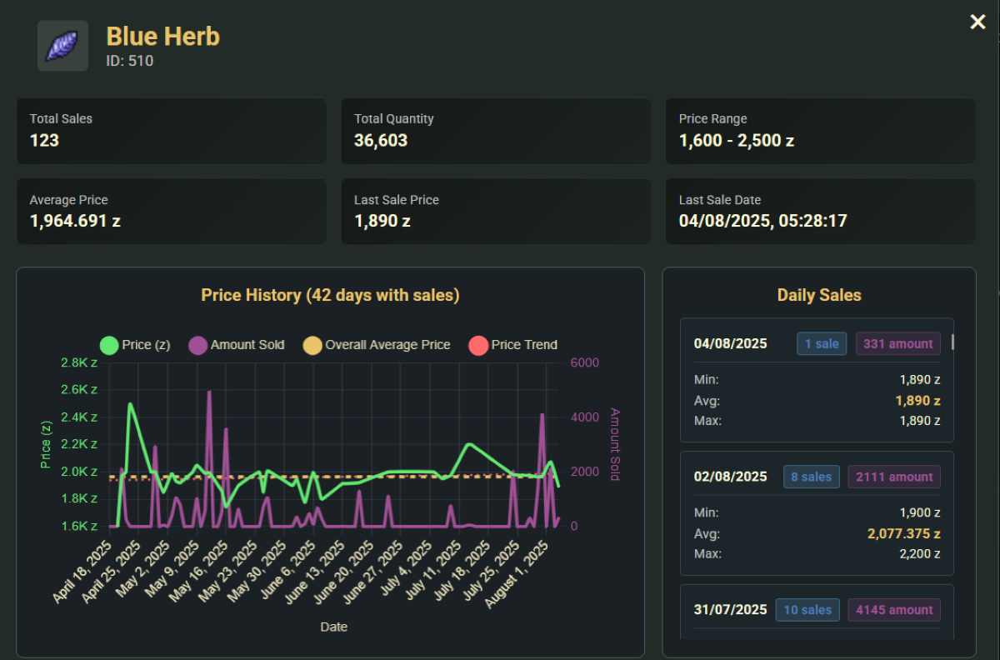
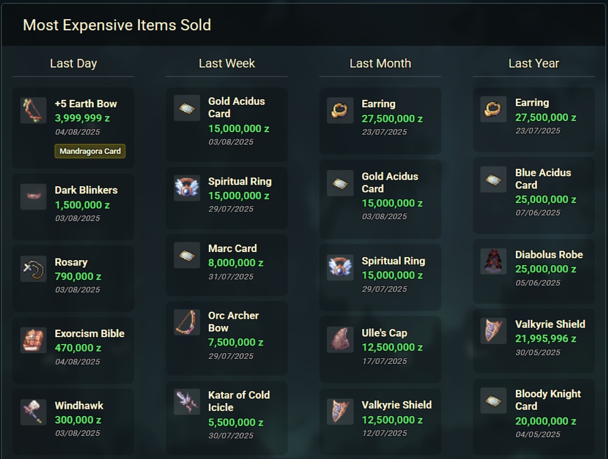

We are excited to announce a major visual update to the Fenrir website, rolling out a suite of powerful new **Control Panel** features! This update significantly enhances the website's functionality, integrating your in-game activities with a modern, user-friendly web interface.

This is the first of several planned updates aimed at creating the most advanced and helpful Control Panel available. Let’s explore the new tools you can start using right now!

<!-- more -->

## 🛒 Live Market

The **Live Market** gives you a near real-time view of the player economy from your browser or smartphone.

This tool connects directly to the game servers to display active player shops. It functions as a remote window into the game's market, with separate tabs to view items being sold and items being bought. You can use the search bar to find specific items, cards, merchant names, or shop titles.

### Key Features
- **See Full Item Details**: View not just the item, but also its refinement level, cards, enchantments and elements.
- **Vendor Information**: Each listing shows the seller's shop and character name, price, and exact map coordinates. By clicking on the Location, it will copy the navigation coordinates that you can past straight into your game!
- **Live Data**: The market view is updated in near real-time, so you always have current information for buying, selling, or simply checking prices. The delay was added to still give an advantage for in-game players using the '@ws/@wb' commands.

## 💸 Vending History

Make informed decisions with our new data-driven vending tools. We now log every completed player transaction to provide you with unparalleled market insight.

This feature is a detailed encyclopedia of item sales history. By searching for an item, you can access a wealth of information to understand its market value.

Our system logs every sale from player vendors. The Vending History page allows you to query this massive database for any item, presenting historical data through an easy-to-use interface.

#### Key Features
- **Overall Statistics**: See an item's total sales volume, total quantity sold, and the current price range. The average price and last sale price are also clearly displayed.
- **Price History Graph**: A large chart visualizes the item's price trend, the amount sold each day, and the overall average price over time.
- **Daily Sales Breakdown**: View detailed sales data for specific days, including the minimum, average, and maximum price for that day.

## 📈 Vending Statistics
This page provides a high-level dashboard of the most significant market activity.

The Vending Statistics page queries our sales logs to identify and rank the highest-value transactions, giving you a quick snapshot of what's popular and valuable in the market.

#### Key Features
- **Top Sales Leaderboard**: Displays the "Most Expensive Items Sold" across various time frames: Last Day, Last Week, Last Month, and Last Year.
- **Track High-Value Items**: Quickly see which big-ticket items, like a +5 Earth Bow or a Gold Acidus Card, are being traded and for how much.

---

## 🚀 What's on the Horizon?

This is just the beginning. We're actively working on several more Control Panel features that we hope to roll out in the coming weeks:

-   **Item / Zeny Transaction Logs**: View the history of all item activity and significant zeny transactions on your account.
-   **Guild Roster**: View the current roster of each guild associated with your master account.
-   **Guild Storage**: Search all items stored in guild storage across your guilds.
-   **Guild Storage Logs**: Search and view activity logs for guild storage.
-   **MVP / Killcount Rankings**: An account-based ranking system for MVP and monster kills.

We are incredibly excited to bring you these new tools and will continue to work on improving the Fenrir player experience. Log in to the website to check out the new features, and stay tuned for more updates!