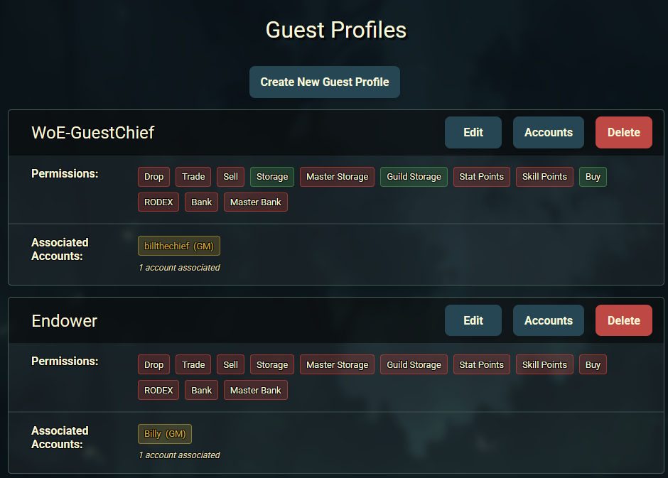
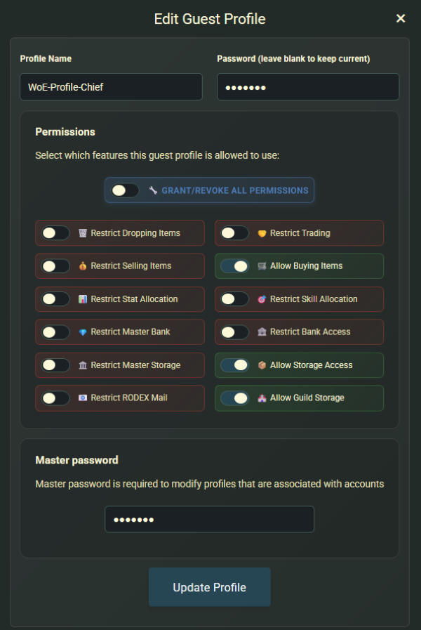
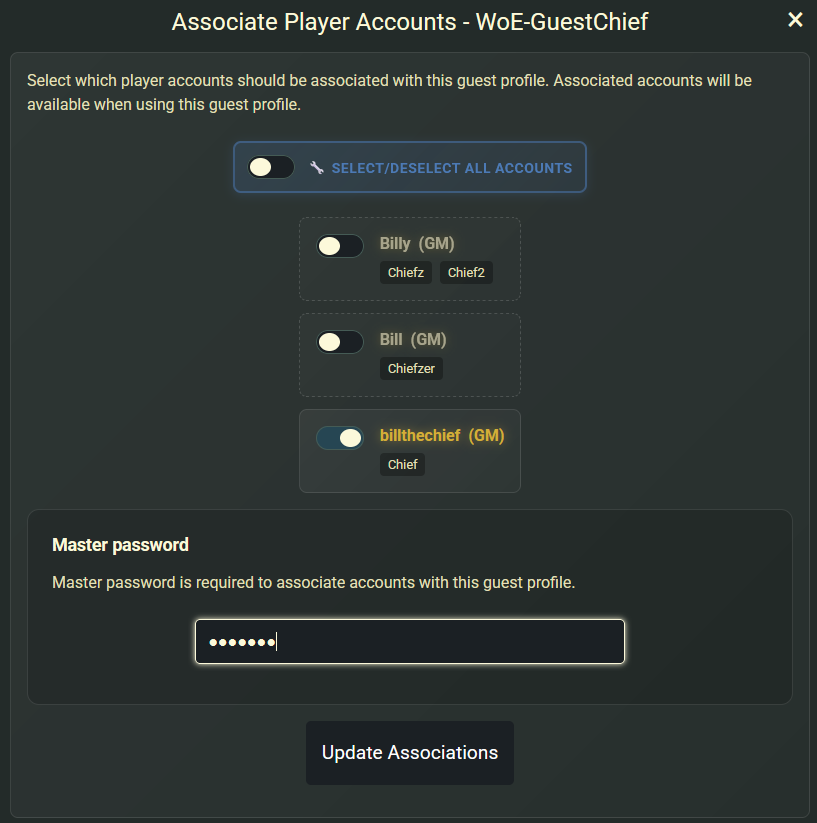

We're thrilled to announce the launch of **Guest Profiles**, a _much-requested_ security feature that lets you safely share access to your Fenrir Saga accounts with **trusted friends**. This powerful Control Panel tool is intented to give you more control over what guests can and cannot do when playing on your accounts.

Say goodbye to sharing your actual passwords! Guest Profiles have their own password and provide a secure, customizable way to let others enjoy your characters while protecting your valuable items and progress.

<!-- more -->

## 🛡️ What Are Guest Profiles?

Guest Profiles are secure, restricted login credentials that you can create for trusted individuals. Think of them as "temporary keys" to your accounts that come with built-in safety restrictions. Each guest profile has its own unique password and can be associated with specific player accounts from your master account.

### Key Benefits
- **Granular Control**: Choose exactly what guests can and cannot do
- **Multiple Profiles**: Create up to 10 guest profiles with unique restrictions
- **Account Selection**: Choose which of your player accounts each guest can access
- **Instant Revocation**: Remove access immediately by deleting the profile or changing associations or passwords

## 🎮 How Guest Profiles Work

When someone logs in using a guest profile, they'll see a clear indication that they're using restricted access.

!!! info "In-Game Guest Indicators"
    - **Login Notification**: The game displays "Logged in with Guest Profile" in bright yellow.
    - **Restriction Summary**: A detailed list shows exactly what features are disabled.
    - **Visual Indicators**: Throughout gameplay, restricted features are clearly marked.

The system enforces all restrictions server-side. When a restriction is "kicked-in" you will see the following message:

## 🔧 Setting Up Your First Guest Profile

### Creating a Guest Profile

1. **Navigate to Control Panel**: Log into the Fenrir website and go to the Guest Profiles section.
2. **Click "Create New Guest Profile"**: This opens the creation form.
3. **Choose a Profile Name**: Pick a descriptive name like "Little Brother" or "Weekend Friend".
4. **Set a Unique Password**: Create a secure password for this guest profile only.
5. **Configure Permissions**: Select which features to allow or restrict (see detailed breakdown below).
6. **Save the Profile**: Your new guest profile is ready to use!

### Associating Player Accounts

After creating a guest profile, you need to associate it with specific player accounts:

1. **Click "Accounts" Button**: Next to your guest profile.
2. **Select Player Accounts**: Choose which accounts this guest can access.
3. **Enter Master Password**: This security step confirms you're the account owner.
4. **Save Associations**: The guest can now log into the selected accounts.

!!! warning "Master Password Required for Associations"
    Guest profiles require your master account password for any changes involving account associations. This critical security step ensures only you can modify which accounts guests can access.

## ⚙️ Understanding Permission Restrictions

- Guest Profiles use a comprehensive restriction system with 12 different permission categories. Each restriction can be individually enabled or disabled, giving you precise control over the guest experience.

### 🗑️ Drop Items Restriction
- Prevents guests from dropping items on the ground. Guests can still pickup items from the floor.

### 🤝 Trading Restriction  
- Blocks all player-to-player trading. Other characters trading with a player logged in on a guest profile will receive a specific message: "Cannot trade with guest accounts.".

### 💰 Selling Items Restriction
- Prevents selling items to NPCs, including merchants and shops. For the merchant class, the skill "Vending" and setting up "Buy Shops" will also be restricted.

### 🛒 Buying Items Restriction
- Blocks purchasing items from NPCs and vending shops.

### 📊 Stat Allocation Restriction
- Disables the ability to spend stat points.

### 🎯 Skill Allocation Restriction
- Prevents spending skill points to learn or upgrade skills.

### 📦 Storage Access Restriction
- Blocks access to account Kafra storage.

### 🏛️ Master Storage Restriction
- Prevents access to the master storage through Kafra.

### 🏰 Guild Storage Restriction
- Blocks access to guild storage through Kafra access.

### 📧 RODEX Mail Restriction
- Disables sending, deleting and receiving RODEX mail.

### 🏦 Bank Access Restriction
- Prevents using personal banking services on your game account. Through @bank command and client shortcut (Crtl + B).

### 💎 Master Bank Restriction
- Blocks access to the master bank shared across all accounts through @mbank command.

## 🔒 Management and Security

### Editing and Managing Profiles
You have full control over your profiles at all times. From the Control Panel, you can:

-   **Edit Permissions**: Adjust restrictions on the fly.
-   **Change Passwords**: Easily update a guest's password.
-   **Rename Profiles**: Keep your list organized with descriptive names.
-   **Manage Associations**: Add or remove which player accounts a guest can access.

You can create up to **10 guest profiles**, and each profile can be associated with any number of your player accounts.

### Key Security Principles
-   **Instant Revocation**: To revoke all access for a guest, simply delete their profile, or unassociate it from the account. Active sessions will persist, but will disconnect if returning to character select screen.
-   **Audit Trail**: All guest profile logins are logged, integrating with our existing account security monitoring so there is a clear record of guest vs. owner activity.

## 💡 Best Practices

!!! tip "Start with Maximum Security"
    When creating a new profile, it's always best to start with more restrictions and relax them only as needed. You can always grant more permissions later, but you can't undo a mistake.

### Creating Effective Restrictions
1. **Start Restrictive**: Begin with more restrictions and relax them as needed.
2. **Match the User**: Tailor restrictions to the guest's experience level.
3. **Protect Valuables**: Always restrict storage, trading, and banking for new guests.
4. **Consider the Account**: High-level accounts may need more restrictions than starter characters.

### Profile Management Tips
1. **Descriptive Names**: Use clear names like "Cousin Sarah" or "Guild Friend Mike".
2. **Regular Review**: Periodically check which profiles are still needed.
3. **Password Rotation**: Update guest passwords regularly for security.

!!! danger "Password Conflicts"
    If an account password and associated guest password are the same, the original password will take priority and no guest profile will not be used! **Please ensure guest profile passwords are unique!**

## ⚠️ A Note on In-Game Mechanics and Trust

We have designed the Guest Profile system to be as robust and secure as possible, with server-side checks enforcing every restriction you set. However, it's important to understand that these restrictions cannot cover every possible in-game action, especially those that are integral parts of gameplay. The system is comprehensive, but _not entirely bulletproof_.

For example, while a guest might be restricted from dropping, trading, or selling an item, they could still potentially destroy it by attempting a high-risk weapon or armor refine. Actions like this are core game mechanics and are difficult to restrict without fundamentally altering the gameplay experience for the guest.

!!! danger "Share Only With People You Genuinely Trust"
    The Guest Profile feature is a powerful deterrent against accidental mistakes and opportunistic theft, but it is not a complete substitute for good judgment. **Only grant access to individuals you know and trust.**

### Help Us Improve
!!! info "Your Feedback is Valuable"
    We are committed to making this feature as secure as we can. As you use Guest Profiles, if you discover potential loopholes or have ideas for new restrictions that could further protect accounts, we encourage you to share your feedback with our support team. Your suggestions will be invaluable as we continue to enhance this system.

We can't wait to see how you use Guest Profiles to share the adventure with your friends safely. As always, thank you for being a part of the Fenrir Saga community!
