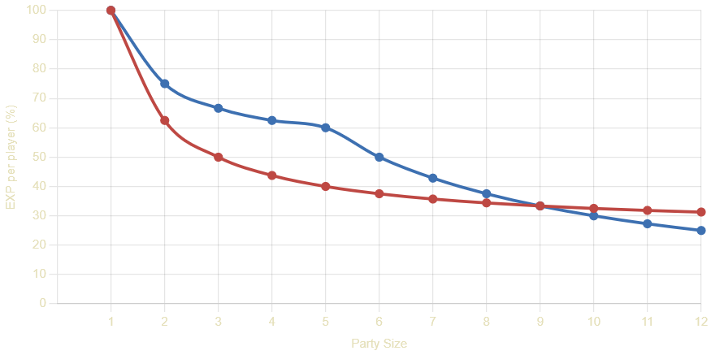

# 🏦 Custom Systems

These unique systems have been implemented on Fenrir Saga to improve core gameplay loops.

### 💰 Master Account Storage & Banking
Enjoy the convenience of a shared storage and zeny bank for all characters under the same master account.

* **Master Storage:** Accessible from any standard Kafra NPC and costs the same as regular storage.
* **Master Bank:** Accessible everywhere.
* **Rodex:** The mail system is free to use but can only be accessed from within towns.

### 🤝 Rebalanced Party Tap System
We've adjusted the "tap" bonus to better reward smaller, active parties.

### 

* The tap bonus has been increased from +25% EXP to **+50% EXP per tap**.
* The bonus is capped at **+200% EXP** (4 unique tappers).
* The bonus only applies if you are in a party set to "Even Share".
* This system benefits parties of 2-5 players while keeping larger parties viable.

### ✨ Seal Quests & God Items
Seal Quests are enabled on Fenrir Saga, but their availability is tied to the current WoE Season.

* **Current Availability:**
    * ✅ **Seal of Sleipnir:** Available
    * ✅ **Seal of Megingjard:** Available
    * ❌ **Seal of Brisingamen:** Unlocked in WoE Season 2
    * ❌ **Seal of Mjolnir:** Unlocked in WoE Season 3

* **Quest Progression:**
    * Unlike official servers, you are never permanently locked out of a Seal quest.
    * Once a Seal quest is unlocked by the server, it remains accessible to all characters, provided you have completed the preceding Seal quests on that character.

### 🏰 Guild Dungeon Warper NPC
For guilds that don't own a castle, a special NPC in each Guild Base (accessible via Kafra) provides access to the guild dungeons for a fee.

* **One-Time Pass:** `100,000z`
* **Three-Hour Pass:** `250,000z` (unlimited entries for 3 hours)