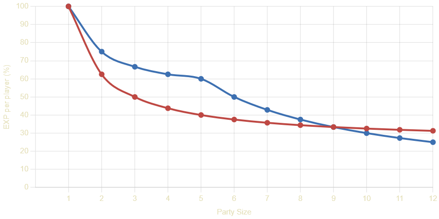

# 🏦 Custom Systems

These unique systems have been implemented on Fenrir Saga to improve core gameplay loops.

### 💰 Master Account Storage & Banking
Enjoy the convenience of a shared storage and zeny bank for all characters under the same master account.

* **Master Storage:** Accessible from any standard Kafra NPC and costs the same as regular storage.
* **Master Bank:** Accessible everywhere.
* **Rodex:** The mail system is free to use but can only be accessed from within towns.

### 🤝 Rebalanced Party Tap System
We've adjusted the "tap" bonus to better reward smaller, active parties.

### 

* The tap bonus has been increased from +25% EXP to **+50% EXP per tap**.
* The bonus is capped at **+200% EXP** (4 unique tappers).
* The bonus only applies if you are in a party set to "Even Share".
* This system benefits parties of 2-5 players while keeping larger parties viable.

### ✨ Seal Quests & God Items
Seal Quests are enabled on Fenrir Saga, but their availability is tied to the current WoE Season.

* **Current Availability:**
    * ✅ **Seal of Sleipnir:** Available
    * ✅ **Seal of Megingjard:** Available
    * ✅ **Seal of Brisingamen:** Available
    * ✅ **Seal of Mjolnir:** Available

* **Quest Progression:**
    * Unlike official servers, you are never permanently locked out of a Seal quest.
    * Once a Seal quest is unlocked by the server, it remains accessible to all characters, provided you have completed the preceding Seal quests on that character.

### 🏰 Guild Dungeon Warper NPC
For guilds that don't own a castle, a special NPC in each Guild Base (accessible via Kafra) provides access to the guild dungeons for a fee.

* **One-Time Pass:** `100,000z`
* **Three-Hour Pass:** `250,000z` (unlimited entries for 3 hours)

### 🔦 Daily Spotlight
Each day at 4:00 AM UTC, one of 12 map regions is randomly selected as the active Spotlight.

* +50% mob spawn density on non-Boss monsters in the region.
* Fatigue mechanic disabled in the region.
* Rotation cycles all 12 regions before repeating.
* Today and tomorrow's region can be checked on the website or through `@spotlight`.

??? note "Regions"

    1. **Prontera**
       `prt_fild00, prt_fild01, prt_fild02, prt_fild03, prt_fild04, prt_fild05, prt_fild06, prt_fild07, prt_fild08, prt_fild09, prt_fild10, prt_fild11, prt_maze01, prt_maze02, prt_maze03, prt_sewb1, prt_sewb2, prt_sewb3, prt_sewb4`
    2. **Payon and Mt. Mjolnir**
       `pay_dun00, pay_dun01, pay_dun02, pay_dun03, pay_dun04, pay_fild01, pay_fild02, pay_fild03, pay_fild04, pay_fild05, pay_fild06, pay_fild07, pay_fild08, pay_fild09, pay_fild10, pay_fild11, mjolnir_01, mjolnir_02, mjolnir_03, mjolnir_04, mjolnir_05, mjolnir_06, mjolnir_07, mjolnir_08, mjolnir_09, mjolnir_10, mjolnir_11, mjolnir_12, mjo_dun01, mjo_dun02, mjo_dun03`
    3. **Geffen Region**
       `gef_dun00, gef_dun01, gef_dun02, gef_dun03, gef_fild00, gef_fild01, gef_fild02, gef_fild03, gef_fild04, gef_fild05, gef_fild06, gef_fild07, gef_fild08, gef_fild09, gef_fild10, gef_fild11, gef_fild12, gef_fild13, gef_fild14, orcsdun01, orcsdun02`
       Excluded: `gefenia01, gefenia02, gefenia03, gefenia04`
    4. **Morroc**
       `moc_fild01, moc_fild02, moc_fild03, moc_fild07, moc_fild11, moc_fild12, moc_fild13, moc_fild16, moc_fild17, moc_fild18, moc_fild20, moc_pryd01, moc_pryd02, moc_pryd03, moc_pryd04, moc_pryd05, moc_pryd06, in_sphinx1, in_sphinx2, in_sphinx3, in_sphinx5, anthell01, anthell02`
       Excluded: `in_sphinx4, moc_fild21, moc_fild22`
    5. **Alberta, Izlude, Byalan, and Comodo**
       `beach_dun, beach_dun2, beach_dun3, cmd_fild01, cmd_fild02, cmd_fild03, cmd_fild04, cmd_fild05, cmd_fild06, cmd_fild07, cmd_fild08, cmd_fild09, iz_dun00, iz_dun01, iz_dun02, iz_dun03, iz_dun04, tur_dun01, tur_dun02, tur_dun03, tur_dun04, tur_dun05, treasure01, treasure02`
    6. **Aldebaran and Lutie**
       `alde_dun01, alde_dun02, alde_dun03, alde_dun04, c_tower1, c_tower2, c_tower3, c_tower4, xmas_dun01, xmas_dun02, xmas_fild01`
    7. **Glast Heim**
       `gl_cas01, gl_cas02, gl_chyard, gl_dun01, gl_dun02, gl_knt01, gl_knt02, gl_prison, gl_prison1, gl_sew01, gl_sew02, gl_sew03, gl_sew04, gl_church, gl_in01, gl_step`
    8. **Lighthalzen and Einbroch**
       `ein_dun01, ein_dun02, ein_fild01, ein_fild02, ein_fild03, ein_fild04, ein_fild05, ein_fild06, ein_fild07, ein_fild08, ein_fild09, ein_fild10, kh_dun01, kh_dun02, lhz_dun01, lhz_dun02, lhz_dun04, lhz_fild01, lhz_fild02, lhz_fild03, mag_dun01, mag_dun02`
       Excluded: `lhz_dun03`
    9. **Yuno, Juperos, and Hugel**
       `yuno_fild01, yuno_fild02, yuno_fild03, yuno_fild04, yuno_fild05, yuno_fild07, yuno_fild08, yuno_fild09, yuno_fild10, yuno_fild11, yuno_fild12, juperos_01, jupe_core, hu_fild01, hu_fild02, hu_fild03, hu_fild04, hu_fild05, hu_fild06, hu_fild07`
       Excluded: `yuno_fild06, abyss_01, abyss_02, abyss_03`
    10. **Rachel and Ice Dungeon**
        `ice_dun01, ice_dun02, ice_dun03, ice_dun04, ra_fild01, ra_fild02, ra_fild03, ra_fild04, ra_fild05, ra_fild06, ra_fild07, ra_fild08, ra_fild09, ra_fild10, ra_fild11, ra_fild12, ra_fild13, ra_san01, ra_san02, ra_san03, ra_san04, ra_san05, ve_fild01, ve_fild02, ve_fild03, ve_fild04, ve_fild05, ve_fild06`
        Excluded: `ve_fild07, thor_v01, thor_v02, thor_v03`
    11. **Overseas and New World**
        `amatsu, ama_in01, ama_in02, ama_fild01, ama_dun01, ama_dun02, ama_dun03, ayo_dun01, ayo_dun02, ayo_fild01, ayo_fild02, gon_dun01, gon_dun02, gon_dun03, gon_fild01, lou_dun01, lou_dun02, lou_dun03, lou_fild01, man_fild01, man_fild02, man_fild03, spl_fild01, spl_fild02, spl_fild03`
    12. **Umbala and Odin Temple**
        `niflheim, nif_fild01, nif_fild02, odin_tem01, odin_tem02, nameless_n, um_dun01, um_dun02, um_fild01, um_fild02, um_fild03, um_fild04, yggdrasil01`
        Excluded: `odin_tem03, abbey01, abbey02, abbey03`

    *Moscovia (`mosk_dun01`, `mosk_dun02`, `mosk_dun03`, `mosk_fild02`) and Thanatos Tower (`thana_t01`, `thana_t02`, `thana_t03`, `thana_t04`, `thana_t05`, `thana_t06`, `thana_t07`, `thana_t08`, `thana_t09`, `thana_t10`, `thana_t11`, `thana_t12`) are not part of the rotation.*

### 🔥 Spotlight Embers
Mobs on an active spotlight map have a chance to drop a **Spotlight Ember**. The chance scales with
the mob's max HP: **0.06% at 2,000 HP and below**, up to **0.26% at 10,000 HP and above**.

| Mob | HP | Rate |
|---|---|---|
| Spore | 510 | 0.06% |
| Desert Wolf | 1716 | 0.06% |
| Hill Wind | 3189 | 0.09% |
| Myst Case | 3450 | 0.10% |
| Pitman | 5015 | 0.14% |
| Siroma | 6800 | 0.18% |
| Raydric | 8613 | 0.23% |
| Stalactic Golem | 18700 | 0.26% |

*Formula: `(max(5, min(25, (mob_max_hp / 10000) * 25)) + 1) / 10001`*

* Using one on a spotlight-eligible map activates Spotlight there for 2 hours.
* Can't be used on a map with an active spotlight.
* Failed use — map already active or ineligible — doesn't consume the Ember.
* Can't be stolen.
* Doesn't drop from Ember-triggered spotlights.
* `@embers` shows Ember-triggered spotlight status and remaining duration.