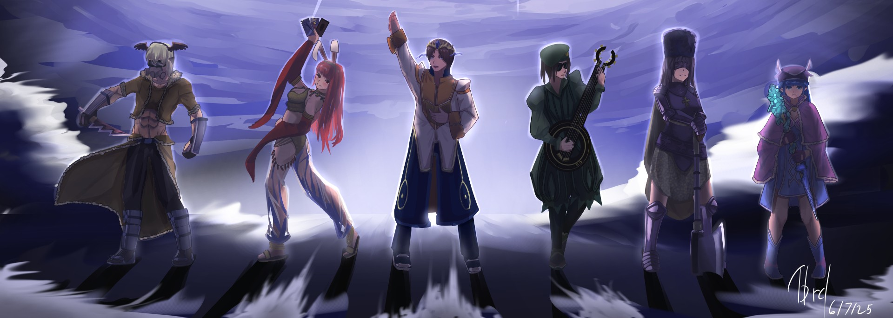

If you've just started or is a returning player in the world of Ragnarok Online, this post is for you! Here you can find some basics about the core game together with some tips on how to enhance your experience in **Fenrir Saga**. Hope you enjoy it, and welcome in!

<!-- more -->

## I. Introduction: Your Adventure Begins!

The term "pre-renewal" signifies Ragnarok Online as it existed before several major updates that significantly altered gameplay. This version offers a nostalgic experience characterized by distinct mechanics for stats, experience gain, and class abilities. Players accustomed to modern MMORPGs or Renewal RO will find a different pace and a greater emphasis on strategic character development and party play.

!!! info "Fenrir Saga Era"
    Fenrir Saga is an **Episode 13.2** server. This means the world includes content such as the Ash Vacuum, Splendide, Manuk, and the Nidhoggur's Nest instance. 
    
    Key server mechanics include a maximum Attack Speed (ASPD) of **190** and rates of **1.5x Base/1.5x Job EXP**. For a full breakdown, check out our [**Server Information**](./../../features/server-information.md) page.

While these advanced areas represent exciting future goals, this guide will focus on the foundational knowledge every new adventurer needs to take their first confident steps.

## II. Taking Your First Steps: Core Concepts

Understanding the fundamentals of character creation and core game mechanics is essential. These initial choices will shape your entire adventure.

### Creating Your First Character
Every player's journey begins humbly as a **Novice**. The character creation process is straightforward. As a Novice, you'll learn the very basics of interaction and combat, preparing you for your future class.

### Understanding Levels: Base vs. Job
Your character progresses through two distinct types of levels:

* **Base Level:** Represents your character's overall growth. Gaining Base Levels awards **Status Points** to increase your core stats.
* **Job Level:** Reflects your mastery of your current class. Each Job Level gained grants one **Skill Point** to learn new skills. When you change jobs (e.g., from Novice to Swordsman), your Job Level resets to 1.

!!! warning "Maximum Your Job Level!"
    
    * **Novice:** Job Level **10**.
    * **First Class (e.g., Acolyte):** Job Level **50** (you can change to a second class from Job Level **40**).
    * **Second Class (e.g., Priest):** Job Level **50**.
    
    Changing jobs early (e.g., at job level **40**) means you will **permanently lose out on valuable skill points**, which can significantly impact your character's power and versatility later on.

### The Building Blocks: Your Six Core Stats
Status points are invested into six core stats. Understanding their effects is key to building an effective character.

!!! tip "Don't Fear Mistakes!"
    While planning your stats is important, don't worry about making a permanent mistake! Fenrir Saga has a **[Skill & Stat Reset NPC](./../../features/qol-npcs.md)** that can help you re-spec your character (for a Zeny fee).

| Stat | Primary Effects | Key Secondary Effects |
|---|---|---|
| **`STR`** | Increases melee ATK & Weight Limit. | Bonus ATK at thresholds; +1 ranged ATK per 5 STR. |
| **`AGI`** | Increases Attack Speed (ASPD) & Flee (dodge rate). | Improves movement speed for some classes. |
| **`VIT`** | Increases Max HP, DEF, & HP recovery from items. | Adds resistance and reduces duration of Stun/Poison. |
| **`INT`** | Increases Max SP, MATK, MDEF, & SP recovery from items. | Adds resistance to Blind/Silence; boosts Heal power. |
| **`DEX`** | Increases ranged ATK, HIT, & reduces cast time. | Improves Steal/Forge/Brew success; slight ASPD boost. |
| **`LUK`** | Increases Critical Rate (CRIT) & Perfect Dodge. | Adds minor resistance to many statuses; boosts auto-cast chance. |

### The Currency of the Land: Zeny
`Zeny` is the lifeblood of the economy. You'll earn it by selling loot from monsters to NPCs. As you progress, you can become a merchant and vend to other players, a practice made easy on Fenrir Saga with the `@autotrade` command.

## III. Navigating the World: UI & Controls

Familiarizing yourself with the classic user interface and controls is crucial for a smooth experience.

### A Tour of Your Screen: Key UI Elements
* **📝 Basic Info (`Alt+V`):** Your main hub for HP/SP, Levels, Zeny, and buttons for other windows.
* **🎒 Inventory (`Alt+E`):** Shows all items you are carrying.
* **🤺 Equipment (`Alt+Q`):** Shows your equipped gear and detailed stats.
* **💪🏻 Status (`Alt+A`):** Shows your Status window where you allocate and check your points. 
* **🌳 Skill Tree (`Alt+S`):** Where you learn new skills and drag them to your hotkey bar.
* **⌨️ Hotkey Bar (`F1-F9`):** Quick-slots for your most-used skills and items. Press `F12` to display over four different bars.
* **💬 Chat Window (`F10`):** Where all messages appear.
* **🗺️ Minimap (`Ctrl+Tab`):** Your guide to the local area. Use the `/where` command to see your exact coordinates.

### Mouse and Movement Basics
* **Movement:** Left-click on the ground to move. Hold to walk continuously.
* **Interaction:** Left-click an NPC to talk or a monster to target it.
* **Camera:** Hold the right mouse button and drag to rotate. Use the mouse wheel to zoom. Double-right-click to reset the camera's direction.

## IV. Essential Commands & Shortcuts

Learning a few key commands and shortcuts will drastically improve your gameplay.

### Keyboard Shortcuts You Need to Know

| Action | Shortcut(s) | Brief Note |
|---|---|---|
| Sit / Stand | `Insert` | Essential for HP/SP regeneration. |
| Cycle Hotkey Bars | `F12` | Access up to 36 skill/item slots. |
| Toggle Continuous Attack | `/nc` or `/noctrl` | Click once to attack repeatedly. Useful for melee. |
| Target Support Skill w/o Shift | `/ns` or `/noshift` | Easier targeting of friendly skills like Heal. |

### Essential Chat Commands

| Action | Command(s) | Purpose |
|---|---|---|
| Show Location | `/where` | Displays your current map and X,Y coordinates. |
| Create Party | `/organize "Party Name"` | Forms a new party with the specified name. |
| Leave Party | `/leave` | Allows you to exit your current party. |
| Block Whispers | `/ex "charactername"` | Prevents a specific player from messaging you. |
| List In-Game Commands | `/h` or `/help` | Shows a list of available chat commands. |

!!! tip "Discover Our Custom Commands!"
    This is just a sample of the default commands. Fenrir Saga has dozens of powerful, custom Quality of Life commands to make your life easier!
    
    Check out our **[Complete Player Commands Guide](./../../features/qol-commands.md)** to learn about `@mobinfo`, `@autotrade`, `@whodrops`, `@glog`, and many more!

## V. Vital Services: The Kafra Corporation

Kafra Employees are your best friends in Rune-Midgard, offering essential services in every town.

* **Storage:** Your personal storage, this one is not shared across all characters on your account.
* **Master Storage:** Your master account-wide storage.
* **Teleportation Service:** Instant travel between major cities for a Zeny fee. Not all Kafra's allow teleportation accross all cities.
* **Save Service:** **Free and essential!** This sets your respawn point. Save in every new town you visit if you wanna respawn there!

!!! note "Master Storage on Fenrir Saga"
    In addition to your personal Kafra Storage, Fenrir Saga features a **Master Storage** system. This storage is shared across **all game accounts linked to your single Master Account**, making it incredibly easy to transfer items between your characters. Learn more on our [**Custom Systems**](./../../features/systems.md) page.

## VI. Choosing Your Path: An Introduction to First Classes

At Job Level 10, after allocating all 9 available skill points into the "Basic Skill" tree, you are ready to choose your specialized path. The choice of a first class significantly influences your early game experience, affecting combat style, ease of soloing, and party dependence.

### The Main Six First Classes

#### 🛡️ Swordsman
* **Playstyle:** The quintessential melee warrior. Durable frontline fighters who can wield a variety of swords and spears. They can be built to withstand heavy damage (VIT-focused) or to deal consistent damage (STR/AGI-focused).
* **Key Strengths:** Relatively straightforward to play, high survivability due to good HP and defense, making them forgiving for new players.
* **Primary Stats:** `STR`, `VIT`, `AGI`.

#### 🔮 Mage
* **Playstyle:** Masters of elemental magic who cast powerful spells from a safe distance. They excel at exploiting enemy elemental weaknesses and have formidable Area of Effect (AoE) spells.
* **Key Strengths:** High damage potential and ability to clear groups of weaker monsters. Spells generally do not miss.
* **Primary Stats:** `INT`, `DEX`.

#### 🏹 Archer
* **Playstyle:** Ranged combat specialists using bows and arrows to strike from afar. They are adept at "kiting" – maintaining distance while continuously attacking.
* **Key Strengths:** Safe combat style due to range, effective solo leveling, and the advantage of elemental damage via different arrow types.
* **Primary Stats:** `DEX`, `AGI`, (and `LUK` for falcon builds).

#### 💰 Merchant
* **Playstyle:** The economic backbone of Rune-Midgard. They possess skills for Zeny acquisition, item appraisal, and setting up player shops (`@autotrade`). In combat, they use axes/maces and powerful cart-based skills.
* **Key Strengths:** Unique economic advantages, making Zeny more easily, and a surprisingly sturdy melee combat style.
* **Primary Stats:** `STR`, `DEX`.

#### ✨ Acolyte
* **Playstyle:** The primary support class, dedicated to healing (`Heal`) and buffing allies (`Blessing`, `Increase AGI`). They are crucial for tackling difficult content and can effectively combat Undead monsters by using Heal offensively.
* **Key Strengths:** Always in high demand for parties, making it easy to find groups, and a vital, relatively safe role in team play.
* **Primary Stats:** `INT`, `VIT`.

#### 🔪 Thief
* **Playstyle:** Agile and evasive combatants who rely on speed and cunning. They excel at dealing quick bursts of damage with daggers and have high Flee rates. Their skills revolve around stealth, poison, and quick strikes.
* **Key Strengths:** Fast-paced combat, high evasion making them difficult to hit, and satisfying single-target damage.
* **Primary Stats:** `AGI`, `STR`, `DEX`.

!!! tip "Don't get too attached to the script!"
    Ragnarok Online at its core is a Sandbox MMORPG, meaning that you are more than free to experiment with different classes and builds. All that matters is that you have fun in the process!

### A Note on Expanded Classes
Episode 13.2 also includes the **Taekwon Kid**, **Gunslinger**, and **Ninja**. These classes offer very distinct themes and mechanics but can present a steeper learning curve due to unique resource systems and specialized gear. It is generally advisable for new adventurers to first familiarize themselves with the game through one of the main six classes.

## VII. Early Adventure Tips & Tricks

A few key tips can make your initial experience much smoother and more enjoyable.

### Starting Out Strong: The Novice Training Grounds
The Novice Training Grounds is an invaluable starting point. It is **highly recommended** to talk to the NPCs and follow the tutorial here. They serve as an in-game tutorial and provide essential free resources like Novice Potions, fly wings, and basic equipment.

### Early Leveling
After leaving the Training grounds and changing classi, the fields around Prontera (Rockers, Fabres) or Payon (Spores, Willows) are excellent choices to gather some levels.

!!! tip "Party Up for Bonus EXP!"
    Don't be afraid to party with other players! On Fenrir Saga, the **party "tap" bonus is significantly increased**, making group play highly efficient and rewarding right from the start.

### Loot Everything!
It is crucial to pick up all items dropped by monsters. Even "etc" loot like `Jellopies` or `Fluff` can be sold to NPC vendors. This is vital for accumulating the initial Zeny needed for potions and supplies.

!!! tip "Create a Merchant to maximize profits!"
    Merchants have excellent zeny making skills like Overcharge and Discount! Fenrir Saga allows you to have a Merchant in a separate game account autotrading (vending) while you focus on leveling and questing on another game account. Check out our **[Player Commands Section](./../../features/qol-commands.md)** to learn about `@autotrade`.

### Essential Consumables & Item ID
* **Potions:** Always carry HP recovery potions (e.g, `Red Potions`) and SP recovery potions (e.g, `Blue Potions`).
* **Wings:** Always have a stack of `Fly Wings` (random teleport on the same map) and `Butterfly Wings` (teleport to your save point). They are lifesavers.
* **Item Identification:** Items with greyed-out names are unidentified. Buy `Magnifiers` from a Tool Dealer NPC to reveal their stats and make them equippable.

## VIII. Onwards to Adventure!

This guide has laid out the fundamental stepping stones for your journey on Fenrir Saga. Ragnarok Online is a world that rewards exploration, perseverance, and collaboration.

The social aspect of the game is a significant part of its enduring appeal. Don't hesitate to ask questions—whether on our **[Official Discord Server](https://discord.gg/AtZTMwpHCY)** or from fellow players in-game. This wiki itself is a vast repository of information; use it to delve deeper into any topic that piques your interest.

Mistakes will happen, challenges will be faced, but the sense of accomplishment and the friendships forged along the way are what make the experience memorable.

Good luck, have fun, and may your adventures in Rune-Midgard be grand!